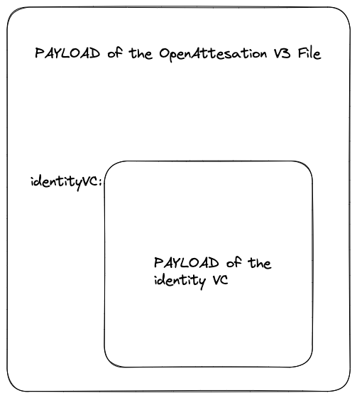

# How to verify a Combined VC
Before reading this document, you must first have a combined VC, so go and read about it in the how to make combined vc document.

This document will go through the steps on how to verify a combined vc.

First things first, we need to make it clear that a **Combined VC** is nothing more than an OpenAttestation v3 file with "some" knowledge about the embedded identity VC.

As such, there are 2 layers to the verification.

1. The inner identity VC verification
2. The outer OpenAttestation verification.

# How it works

## Inner identity vc verification:

When a user drops in his Combined VC into the verifier, the verifier first parses out the payload of the identity vc. It then proceeds to verify the identity vc.

The steps to verifying a identity vc is as follows:
- Integrity check:
  - resolve the public key that was used to sign the Verifiable Credential
  - sign the payload and compare its `proofValue` to ensure that it matches (digital signature concept)
  - if nothing errors out, then the identity vc is considered untampered
- Status check:
  - the next check is to determine whether the identity vc's status is still in good standing.
  - depending on the identity vc's issuer, they might have different approaches to tackle this problem.
  - In this combined vc (NDI) case, they are utilising the concept of Status Lists to maintain the status of the identity vc. Check [here](https://w3c.github.io/vc-status-list-2021/) for a more indepth dissection on how the concept works.
  - In brief, one would need to first resolve the StatusList Credential from the `statusListCredential` field, recursively verify it (its a VC as well) then obtain the `encodedList` value.
  - The `encodedList` value is nothing more than an encoded bitstring (a long string of zeros). At each index, it will indicate the status of that particular document's status. So a 1 would be a revoked document, a 0 would be a document that is unrevoked.
  - Comparing the `statusListIndex` field of the identity VC and this `encodedList`, will give us the status of the identity VC.

If both checks pass, it will assert that the identity vc has not been tampered and is in good standing.

## Outer combined vc verification:

We can then proceed on to the normal OpenAttestation checks. 

Note that since we are depending on the identity VC for our `ISSUER_IDENTITY` check, that is considered done. We can then proceed on the `DOCUMENT_INTEGRITY` check and `DOCUMENT_STATUS` check. I would not describe these methods in details as they are well documented on our documentation [website](https://www.openattestation.com/).

I must stress again that at this point, we are verifying the document integrity and the document status of the combined vc (the PAYLOAD of the OpenAttestation v3 File).

Once those checks are done, we will finally compare the `id` field of the `credentialSubject` of the identity vc with the `issuer.id` field of the combined vc. 

If those are equal, and if all the previous checks do not fail, then the combined vc is considered to be verified.

# Things to note

Since the `ISSUER_IDENTITY` check (ie the verification of identity vc check) is non-standard compared to our other `ISSUER_IDENTITY` methods (DID-DNS, DNS-Text), an implementor who wants to enhance their functionality of their verifier needs to implement their own custom verifier. See [here](https://github.com/Open-Attestation/adr/blob/master/verifier.md) for a discussion on how to extend the usual verifiers. 

Otherwise, feel free to reference this repo's implementation and customise it to your liking.
