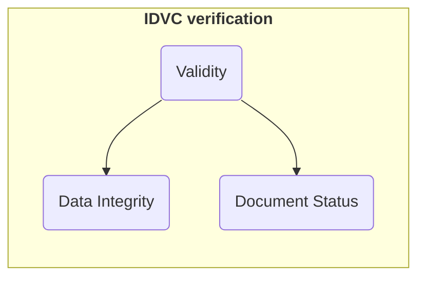
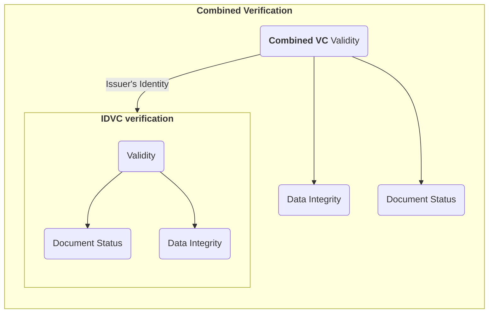

# How to verify a Combined VC

Before reading this document, you must first have a combined VC, so go and read about it in the how to make combined vc [document](./how-to-make-combined-vc.md).

This document will go through the steps on how to verify a combined vc.

There are 2 layers to the verification, plus a final binding check between the 2 documents.

1. The inner identity VC verification
2. The outer OpenAttestation verification.
3. Final wallet address binding check.

# How it works

## Inner identity vc verification:

When a user drops in his Combined VC into the verifier, the verifier first parses out the payload of the identity vc. This is found in the path of `issuer.identityProof.data.issuer`.

It will then proceed to verify the identity vc.

The steps to verifying a identity vc is as follows:

- Integrity check:
  - resolve the public key that was used to sign the Verifiable Credential
  - sign the payload and compare its `proofValue` to ensure that it matches.
  - if nothing errors out, then the identity vc is considered untampered.
- Status check:
  - the next check is to determine whether the identity vc's status is still in good standing.
  - depending on the identity vc's issuer, they might have different approaches to tackle this problem.
  - In this combined vc (NDI) case, they are utilising the concept of Status Lists to maintain the status of the identity vc.
  - Check [here](https://www.w3.org/TR/vc-status-list/) for a more indepth dissection on how the `statusListCredential` concept works.
  - In brief, one would need to first resolve the StatusList Credential from the `statusListCredential` field, recursively verify it (its a VC as well) then obtain the `encodedList` value.
  - The `encodedList` value is nothing more than an encoded bitstring (a long string of zeros). At each index, it will indicate the status of that particular document's status. So a 1 would be a revoked document, a 0 would be a document that is unrevoked.
  - Comparing the `statusListIndex` field of the identity VC and this `encodedList`, will give us the status of the identity VC.

If both checks pass, it will assert that the identity vc has not been tampered and is in good standing.

Note that for IDVCs, there is no issuer's identity check since the issuer identity is the root trust.



## Outer combined vc verification:

We can then proceed on to the normal OpenAttestation checks.

Note that since we are depending on the identity VC for our `ISSUER_IDENTITY` check, that is considered done, however, that being said, there is a cursory signature check to ensure that the signature of the combined document is not tampered.

We can then proceed on the `DOCUMENT_INTEGRITY` check and `DOCUMENT_STATUS` check.

Once those checks are done, we will finally compare the `id` field of the `credentialSubject` of the identity vc with the `issuer.id` field of the combined vc.

This ensures that the wallet address that is used to sign the outer combined document is the same as the one attested by the trust anchor.

If those are equal, and if all the previous checks do not fail, then the combined vc is considered to be verified.



## Things to note:

Do note that the verifier that is used to verify a combined VC is not included in the default list of verifiers as exported by `oa-verify`.

As such, one would need to enhance the verifier by adding it to the list of verifiers.

```ts
import {
  verificationBuilder,
  openAttestationVerifiers,
  tradeTrustIDVCIdentityProof
} from "@tradetrust/oa-verify";

const verify = verificationBuilder(
  [...openAttestationVerifiers, tradeTrustIDVCIdentityProof],
  {
    network: <NETWORK>
  }
);
```
