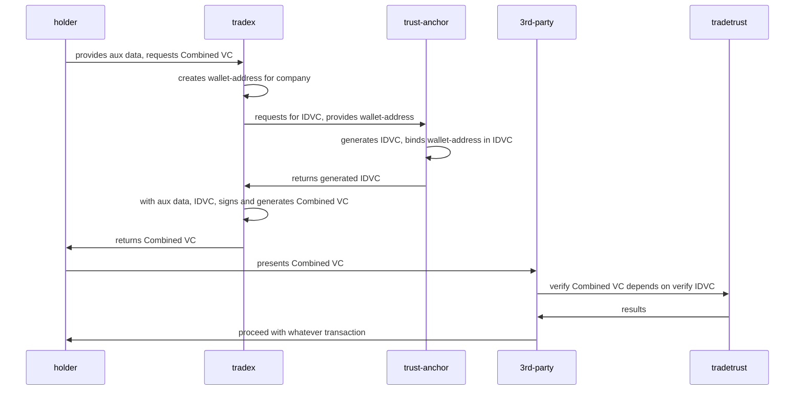

# Sequential Flow of NDI-Tradex-TradeTrust pilot:

## Stage:

| Parties            | Role(s)                                            |
|--------------------|----------------------------------------------------|
| NDI / Trust Anchor | Issuer IDVC                                        |
| Tradex             | Issuer Combined VC, custodial of holder's key-pair |
| Tradetrust         | Verifier                                           |
| Company            | Holder of Combined VC                              |
| 3rd Party          | Want to verify presented Combined VC.              |

## Solution Flow:
1. Company provides UEN and auxilary trade data or invoice data and requests for a Combined VC from Tradex.
2. Tradex on behalf of company, creates and holds a key-pair that will be related to the company, for now the key-pair will be recovered from the ethereum wallet address for the pilot.
3. Tradex will interact with NDI/Trust anchor, providing them with the wallet address which NDI will then bind it together with their generated IDVC.
4. NDI will then generate the IDVC of the company with the provided UEN and pass this back to Tradex.
5. The contents of the IDVC only contains the data attested by the trust anchor, ie `companyname`, `uen` and the provided wallet address.
6. Tradex will then generate the combined VC payload, whatever invoice / trade document related data that Tradex can attest to will be included in the combined VC payload.
7. Now, since the combined VC is just an OA document, it will be wrapped and signed with the private key of the wallet address that Tradex holds and controls. 
8. How this occurs has to be indicated in the combined VC itself, in this case, since Tradex is using the wallet to sign the combined document, it needs to indicate that the issuer of the combined VC is the wallet address, ie did:eth:\<WALLET_ADDRESS>. 
9. Tradex **needs to sign and attest to the data** provided by the holder since NDI/trust anchor **did not** attest to those properties.
10. Once the combined document is generated and signed, it is then passed back to the holder for storage. Tradex might want to keep a copy for itself for easy retrieval for its customer.
11. The holder presents this attested combined VC to a 3rd party.
12. The 3rd party in order to verify that this information has been attested by trusted parties, will go to Tradetrust to verify it.
13. Tradetrust, upon recieving the Combined VC, will verify 1) The validity of the IDVC, 2) the validity of the combined document 3) the binding between these documents to ensure that they have generated by the correct parties.

